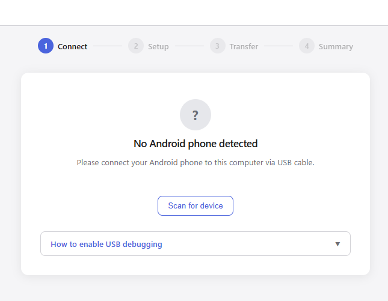
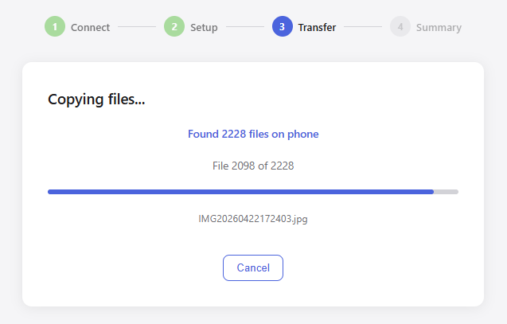

# Android Media Copier (AMC)

Copy photos, videos, documents, and music from your Android phone to your computer over USB — no account, no cloud, no cables except the one you already have.

The app runs entirely on your local machine. Open it via a start script, a browser tab opens automatically, and the server shuts itself down when you close the tab.

---

## How it works

1. Connect your Android phone via USB
2. Run the start script for your platform (see below)
3. A browser tab opens at `http://localhost:3000`
4. Click **Scan for device** — the app detects your phone automatically
5. Choose what to copy: **Images**, **Videos**, **Files**, **Music**, or **All Types**
6. Optionally filter by date range (images and videos only)
7. Pick the source folder on your phone and a destination on your computer — the phone browser opens in the most relevant folder for your chosen file type (DCIM for images/videos, Download for files, Music for music) with shortcut buttons at the top for other common locations
8. Click **Start Copy** — the app scans and copies files, sorted into subfolders by type and date
9. Close the tab when done — the app shuts itself down

---

## Screenshots

| Connect | Setup |
|---------|-------|
|  |  |

| Setup (date range active) | Transfer |
|--------------------------|----------|
|  |  |

| Summary | Summary – files copied detail |
|---------|-------------------------------|
|  |  |

| Summary – files skipped detail | Summary – errors detail |
|--------------------------------|-------------------------|
|  |  |

---

## Requirements

- A computer running Windows, macOS, or Linux
- [Node.js](https://nodejs.org) installed (v18 or later)
- An Android phone with **USB Debugging** enabled (the app walks you through this)
- A USB cable

**Windows only:** [Git for Windows](https://git-scm.com/download/win) is required to run `start.vbs`. If you already use Git Bash, you have it.

> **ADB is included.** The app downloads Android Debug Bridge automatically on first launch. You do not need to install it yourself.

---

## Getting started

### 1. Download the project

Download the ZIP from GitHub and extract it anywhere on your computer.

### 2. Run the start script

**Windows** — double-click `start.vbs`. A terminal window opens, the browser launches, and the terminal closes automatically when you close the browser tab. Use `start.bat` instead if you want to keep the terminal open for troubleshooting.

**macOS / Linux** — open a terminal in the folder and run:

```bash
./start.sh
```

On first launch the script will:
- Install Node.js dependencies
- Build the app
- Download the ADB tool for your platform (requires internet, one time only)

After that, the browser opens automatically and the app is ready.

---

## Enable USB Debugging on your phone

The app includes a step-by-step guide on the connect screen, but here is the short version:

1. Open **Settings** → **About Phone**
2. Tap **Build Number** 7 times until you see *"Developer options unlocked"*
3. Go back to **Settings** → **Developer Options**
4. Enable **USB Debugging**
5. Connect your phone via USB — tap **Allow** when prompted on the phone screen
   > If you are prompted with multiple USB options, choose the one that allows file transfers over USB.

---

## File organisation

Files are copied into type-named subfolders at the destination you choose:

```
Destination/
  images/
    2024/
      06/
        14/
          IMG_4821.jpg
    Unknown/
      photo_no_date.jpg
  videos/
    2024/
      06/
        14/
          VID_0032.mp4
  files/
    report.pdf
    notes.docx
  music/
    song.mp3
```

| File type | Destination structure |
|-----------|----------------------|
| Images | `images/YYYY/MM/DD/` |
| Videos | `videos/YYYY/MM/DD/` |
| Documents & archives | `files/` (flat) |
| Audio | `music/` (flat) |

For images and videos, the date is read from EXIF data embedded in the file. If no EXIF data is present, the file modification date reported by the phone is used. Files with no date at all go into `images/Unknown/` or `videos/Unknown/`.

Deleted files (items in the phone's trash, e.g. `.trashed-*`) are automatically excluded and never copied.

---

## File types

| Option | What gets copied |
|--------|-----------------|
| **Images** | `.jpg` `.jpeg` `.png` `.heic` `.heif` `.webp` `.gif` `.bmp` `.raw` `.dng` `.cr2` `.nef` `.arw` `.orf` |
| **Videos** | `.mp4` `.mov` `.avi` `.mkv` `.3gp` `.m4v` `.wmv` `.ts` |
| **Files** | `.pdf` `.doc` `.docx` `.xls` `.xlsx` `.ppt` `.pptx` `.txt` `.rtf` `.odt` `.ods` `.odp` `.csv` `.zip` `.rar` `.7z` `.epub` `.mobi` |
| **Music** | `.mp3` `.wav` `.flac` `.aac` `.ogg` `.m4a` `.wma` `.opus` `.aiff` |
| **All Types** | All of the above |

### Date range filter

When **Images** or **Videos** (or **All Types**) is selected, you can switch to **Date range** mode and set a From and To date. Only files whose modification date falls within that window will be scanned and copied.

The **Files** and **Music** options always copy all matching files regardless of date — the date range selector is hidden when those types are selected.

---

## Conflict handling

If a file with the same name already exists at the destination, a dialog appears:

| Option | Behaviour |
|--------|-----------|
| Skip | Skip this file, continue with the rest |
| Skip All | Skip all remaining conflicts automatically |
| Overwrite | Replace the existing file with the one from the phone |
| Overwrite All | Replace all remaining conflicts automatically |

---

## Cancelling a transfer

A **Cancel** button is shown at the bottom of the screen while files are being copied. Pressing it stops the transfer immediately and shows a summary of how many files were copied before cancelling.

---

## If your phone is unplugged

If the USB cable is disconnected at any point after the phone has been detected — on the setup screen or during a transfer — the app shows an error screen explaining what happened. Pressing **OK** takes you back to the connect screen where you can plug back in and scan again.

---

## If no files are found

If the selected source folder contains no files matching the chosen type (or date range), the app shows a clear message instead of silently completing with zero results. This can happen if:

- The file type does not match the folder (e.g. looking for images inside the Music folder)
- The date range excludes all available files
- The folder is empty

---

## Languages

The interface is available in:

- English
- Danish (Dansk)
- Spanish (Español)

Select your language from the dropdown in the top right corner. The choice is saved for future sessions.

---

## For developers

### Build requirements

To compile this project you need the following installed on your machine:

- **[Node.js](https://nodejs.org) v18 or later** — required to run the build scripts and TypeScript compiler
- **npm** — comes bundled with Node.js
- **Internet access** — `npm run setup` downloads ADB binaries from Google's servers (one time only)

No other tools are required. ADB does not need to be installed system-wide; the setup script downloads it automatically.

### Building

```bash
npm install        # Install dependencies
npm run setup      # Download ADB binaries for all platforms (one time, needs internet)
npm run dist       # Compile TypeScript + bundle into self-contained executables
```

After `npm run dist`, the `release/` folder contains one self-contained executable per platform, named with the current version:

| File | Platform |
|------|----------|
| `amc-v{version}-win-x64.exe` | Windows x64 |
| `amc-v{version}-macos-x64` | macOS Intel |
| `amc-v{version}-macos-arm64` | macOS Apple Silicon |
| `amc-v{version}-linux-x64` | Linux x64 |

Each executable includes Node.js, the app, and the ADB binary for its platform. End users need nothing installed.

> **Cross-compilation is supported.** You can build the Linux executable from Windows, and vice versa — `pkg` handles all platforms in a single `npm run dist` run.

### Development (without packaging)

```bash
npm install
npm run dev        # Run with ts-node (requires adb in PATH)
```

### Project structure

```
src/
  server.ts               Express + WebSocket server, browser launch, shutdown
  adbPath.ts              Resolves ADB binary path (bundled or system)
  services/
    AdbService.ts         Wraps adb CLI via execFile
    ExifService.ts        Reads EXIF date from local files
    FileService.ts        Local filesystem helpers
    TransferService.ts    Transfer orchestration and event emission
  routes/
    device.ts             GET /api/device/status, /api/device/browse, /api/device/check
    filesystem.ts         GET /api/filesystem/roots, /api/filesystem/browse, /api/filesystem/home
    transfer.ts           POST /api/transfer/start|resolve|cancel
public/
  index.html              Single-page app
  style.css               CSS custom properties, no framework
  app.js                  Vanilla JS
  i18n/                   Localisation strings (en / da / es)
scripts/
  setup.js                Downloads ADB binaries from Google
  rename-release.js       Renames pkg output to include version number
docs/
  screenshots/            App screenshots used in this README
```

### Adding a language

1. Copy `public/i18n/en.json` to `public/i18n/<code>.json` and translate all values
2. Add `<option value="<code>">Language Name</option>` to `#lang-select` in `public/index.html`

---

## Privacy

- The app runs **entirely on your local machine** — no data is sent anywhere
- Files are only read from your phone; **nothing is deleted or moved on the phone**
- ADB binaries are downloaded once from Google's official servers and stored locally

---

## License

MIT

